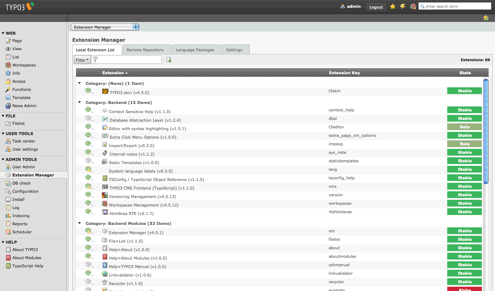

.. ==================================================
.. FOR YOUR INFORMATION
.. --------------------------------------------------
.. -*- coding: utf-8 -*- with BOM.

.. include:: ../Includes.txt

.. _admin-manual:

Administrator Manual
====================

Please install the extension after indexing all files for FAL via scheduler and after converting the default records to FAL, e.g. with the extension we_dam2fal62.
Make sure the table tx_dam still exists and use the backend module to convert the tt_news entries.

Target group: **Administrators**

	Extension Manager
