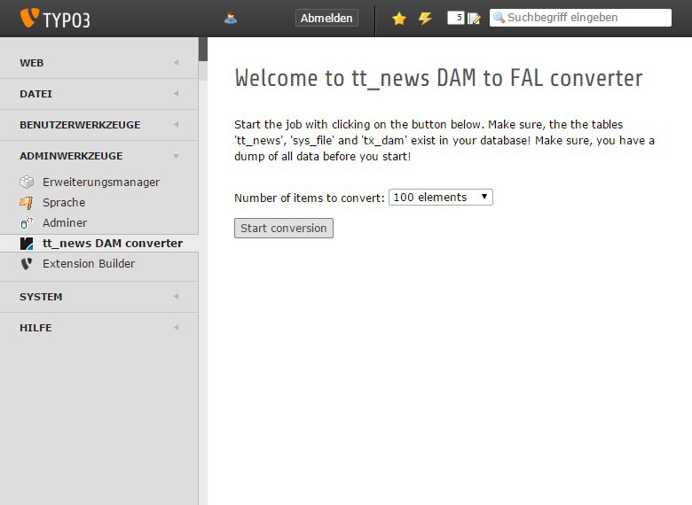

.. ==================================================
.. FOR YOUR INFORMATION
.. --------------------------------------------------
.. -*- coding: utf-8 -*- with BOM.

.. include:: ../Includes.txt

.. _users-manual:

Users manual
============

Use the backend module to convert the existing tt_news entries in the database.
You can select, how many entries should be converted up to 1000 at one time.
The default value is 100 entries.

Target group: **Users**

